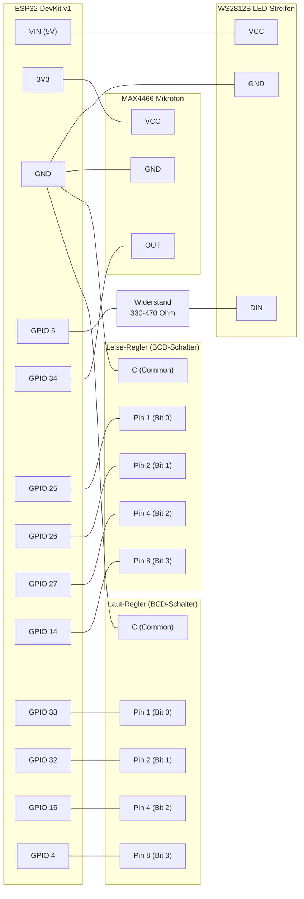

# Kita-Lärmampel: Verkabelung

## Inhaltsverzeichnis
- [Übersicht](#übersicht-mermaid-diagramm)
- [Kabel für Kabel](#kabel-für-kabel)
- [Checkliste vor dem ersten Start](#checkliste-vor-dem-ersten-start)

## Übersicht (Mermaid-Diagramm)

## Kabel für Kabel

Jede Zeile = ein Kabel (oder eine direkte Lötverbindung).

### Stromversorgung

| # | Von | Nach | Hinweis |
|---|---|---|---|
| 1 | ESP32 **VIN** | WS2812B **VCC** | 5 V, rot |
| 2 | ESP32 **GND** | WS2812B **GND** | schwarz |
| 3 | ESP32 **3V3** | MAX4466 **VCC** | 3,3 V, rot |
| 4 | ESP32 **GND** | MAX4466 **GND** | schwarz |
| 5 | ESP32 **GND** | Leise-Regler **C (Common)** | schwarz |
| 6 | ESP32 **GND** | Laut-Regler **C (Common)** | schwarz |

> **Hinweis:** Die GND-Kabel 2, 4, 5, 6 teilen sich denselben GND-Pin am ESP32.
> Auf einem Breadboard legt man alle auf die GND-Schiene; beim Löten
> kann man sie zusammen auf einen Pin führen.

### Datenleitung LED-Streifen

| # | Von | Nach | Hinweis |
|---|---|---|---|
| 7 | ESP32 **GPIO 5** | Widerstand **Seite A** | beliebige Farbe |
| 8 | Widerstand **Seite B** | WS2812B **DIN** | beliebige Farbe |

> **Hinweis:** Der Widerstand (330–470 Ω) liegt **in Serie** auf der Datenleitung —
> d.h. er unterbricht das Kabel zwischen GPIO 5 und DIN.
> Polarität spielt bei Widerständen keine Rolle.

### Mikrofon

| # | Von | Nach | Hinweis |
|---|---|---|---|
| 9 | ESP32 **GPIO 34** | MAX4466 **OUT** | beliebige Farbe |

### Leise-Regler (BCD-Schalter, grün→gelb)

| # | Von | Nach | Hinweis |
|---|---|---|---|
| 10 | ESP32 **GPIO 25** | Leise-Regler **Pin 1** | Bit 0 |
| 11 | ESP32 **GPIO 26** | Leise-Regler **Pin 2** | Bit 1 |
| 12 | ESP32 **GPIO 27** | Leise-Regler **Pin 4** | Bit 2 |
| 13 | ESP32 **GPIO 14** | Leise-Regler **Pin 8** | Bit 3 |

> **Hinweis:** Die Pins am BCD-Schalter sind mit **1, 2, 4, 8** beschriftet
> (Binärwertigkeit, nicht laufende Nummern). Common (C) wurde bereits in Kabel 5 verdrahtet.

### Laut-Regler (BCD-Schalter, gelb→rot)

| # | Von | Nach | Hinweis |
|---|---|---|---|
| 14 | ESP32 **GPIO 33** | Laut-Regler **Pin 1** | Bit 0 |
| 15 | ESP32 **GPIO 32** | Laut-Regler **Pin 2** | Bit 1 |
| 16 | ESP32 **GPIO 15** | Laut-Regler **Pin 4** | Bit 2 |
| 17 | ESP32 **GPIO  4** | Laut-Regler **Pin 8** | Bit 3 |

## Checkliste vor dem ersten Start

- [ ] Alle 17 Verbindungen hergestellt
- [ ] Kein GND-Kabel vergessen (Kabel 2, 4, 5, 6)
- [ ] Widerstand liegt **zwischen** GPIO 5 und WS2812B DIN, nicht parallel
- [ ] WS2812B VCC an **VIN** (5 V), nicht an 3V3
- [ ] MAX4466 VCC an **3V3**, nicht an VIN
- [ ] USB-Netzteil noch **nicht** eingesteckt beim Verdrahten
